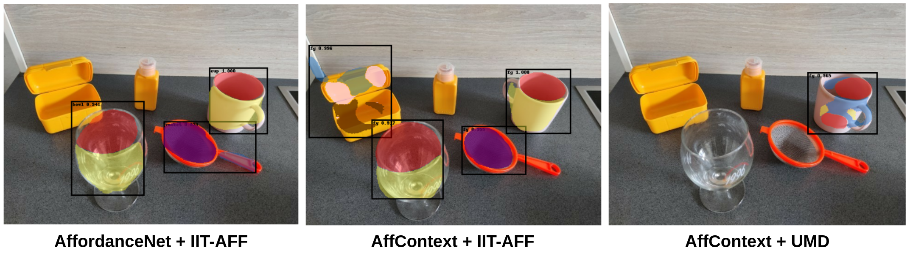
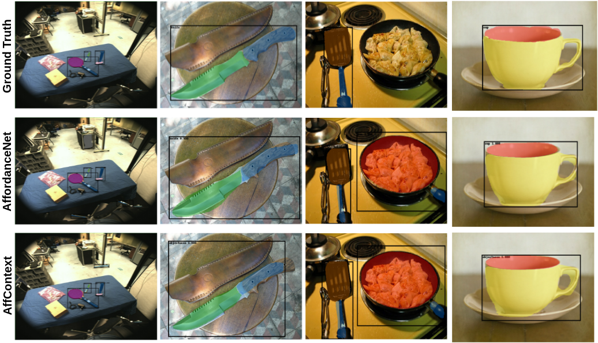
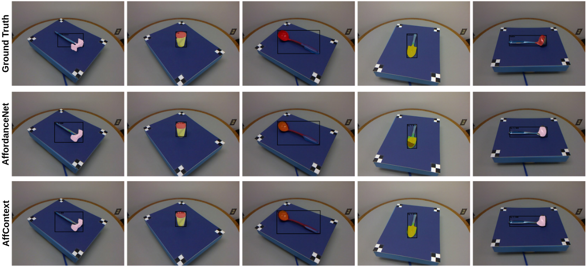
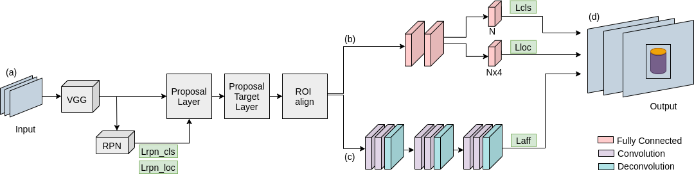
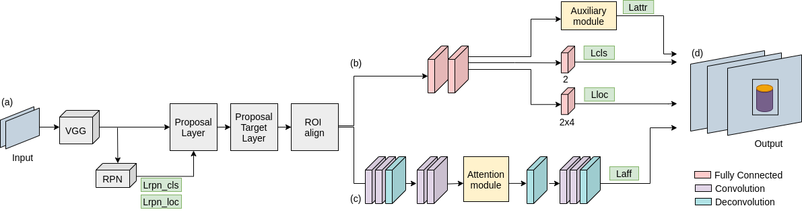

# AffordanceNet and AffContext
This is tensorflow [**AffordanceNet**](https://github.com/nqanh/affordance-net) and [**AffContext**](https://github.com/ivalab/affordanceNet_Context) implementations. 
Both are implemented and tested with **tensorflow 2.3**.

The main **objective** of both architectures is to identify **action affordances**, so that they can be used in real robotic applications to understand the diverse objects present in the environment.

Both models have been trained on [**IIT-AFF**](https://sites.google.com/site/iitaffdataset/) and [**UMD**](http://users.umiacs.umd.edu/~fer/affordance/part-affordance-dataset/) datasets.

Detections on novel image
<p align="center">
    
</p>

Example of ground truth affordances compared with the affordance detection results by AffordanceNet and AffContext on the **IIT-AFF** dataset.

<p align="center">
    
</p>


Example of ground truth affordances compared with the affordance detection results by AffordanceNet and AffContext on the **UMD** dataset.

<p align="center">
    
</p>


**AffordanceNet** simultaneously detects multiple objects with their corresponding classes and affordances. 
This network mainly consists of **two branches**: an **object detection branch** to localise and classify the objects in the image, and an **affordance detection branch** to predict the most probable affordance label for each pixel in the object.

<p align="center">
    
</p>

**AffContext** correctly predicts the pixel-wise affordances independently of the class of the object, which allows to infer the **affordances for unseen objects**. The structure of this network is similar to AffordanceNet, but the object detection branch only performs binary classification into foreground and background areas, and it includes **two new blocks**: an **auxiliary task** to infer the affordances in the region and a **self-attention mechanism** to capture rich contextual dependencies through the region.

<p align="center">
    
</p>


## Results

The results of the tensorflow implementation are contrasted with the values provided in the papers from AffordanceNet and AffContext. 
However, since the procedure of how the results are processed to obtain the final metrics in both networks may be different, the results are also compared with the values obtained by running the original trained models, but processing the outputs and calculating the measures with the code from this repository.
These results are denoted with * in the comparison tables.

| Affordances | AffordanceNet<br>(Caffe) | AffordanceNet* | AffordanceNet<br>(tf) |
| ----------- |:------------------------:|:--------------:|:------------------:|
| contain     | 79.61                    | 73.68          | 74.17              |
| cut         | 75.68                    | 64.71          | 66.97              |
| display     | 77.81                    | 82.81          | 81.84              |
| engine      | 77.50                    | 81.09          | 82.63              |
| grasp       | 68.48                    | 64.13          | 65.49              |
| hit         | 70.75                    | 82.13          | 83.25              |
| pound       | 69.57                    | 65.90          | 65.73              |
| support     | 69.57                    | 74.43          | 75.26              |
| w-grasp     | 70.98                    | 77.63          | 78.45              |
| **Average** | 73.35                    | 74.06          | 74.87              |

| Affordances | AffContext<br>(Caffe) | AffContext* | AffContext<br>(tf) |
| ----------- |:---------------------:|:-----------:|:------------------:|
| grasp       | 0.60                  | 0.51        | 0.55               |
| cut         | 0.37                  | 0.31        | 0.26               |
| scoop       | 0.60                  | 0.52        | 0.52               |
| contain     | 0.61                  | 0.55        | 0.57               |
| pound       | 0.80                  | 0.68        | 0.64               |
| support     | 0.88                  | 0.69        | 0.21               |
| w-grasp     | 0.94                  | 0.88        | 0.85               |
| **Average** | 0.69                  | 0.59        | 0.51               |


## Setup guide

### Requirements
- Python 3
- CUDA 10.1

### Installation

1. Clone the repository into your `$AffordanceNet_ROOT` folder.

2. Install the required Python3 packages with: `pip3 install -r requirements.txt`

### Testing

1. Download the pretrained weights:
    - AffordanceNet [weights](https://www.dropbox.com/s/ze7asu9syte235x/affordancenet_iit.hdf5?dl=0) trained on IIT-AFF dataset.
    - AffContext [weights](https://www.dropbox.com/s/yp7jb1sjrhdllm9/affcontext_umd.hdf5?dl=0) trained on UMD dataset. 

3. Extract the file into `$AffordanceNet_ROOT/weights` folder.

2. Visualize results for AffordanceNet trained on IIT-AFF dataset:
```
python3 affordancenet_predictor.py --config_file config_iit_test
```

3. Visualize results for AffContext trained on UMD dataset:
```
python3 affcontext_predictor.py --config_file config_umd_test
```

### Training

1. Download the IIT-AFF or UMD datasets in Pascal-VOC format following the instructions in [AffordanceNet (IIT-AFF)](https://github.com/nqanh/affordance-net) and [AffContext(UMD)](https://github.com/ivalab/affordanceNet_Context).

2. Extract them into the `$AffordanceNet_ROOT/data` folder and make sure to have the following folder structure for IIT-AFF dataset:
    - cache/
    - VOCdevkit2012/

The same applies for UMD dataset, but folder names should be cache_UMD and VOCdevkit2012_UMD

3. Run the command to train AffordanceNet on IIT-AFF dataset:
```
python3 affordancenet_trainer.py --config_file config_iit_train
```

4. Run the command to train AffContext on UMD dataset:
```
python3 affcontext_trainer.py --config_file config_umd_train
```

### Acknowledgements
This repo used source code from [AffordanceNet](https://github.com/nqanh/affordance-net) and [Faster-RCNN](https://github.com/FurkanOM/tf-faster-rcnn)
